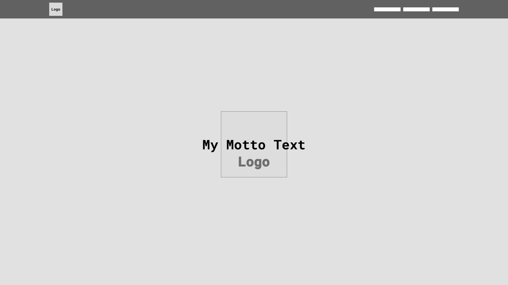
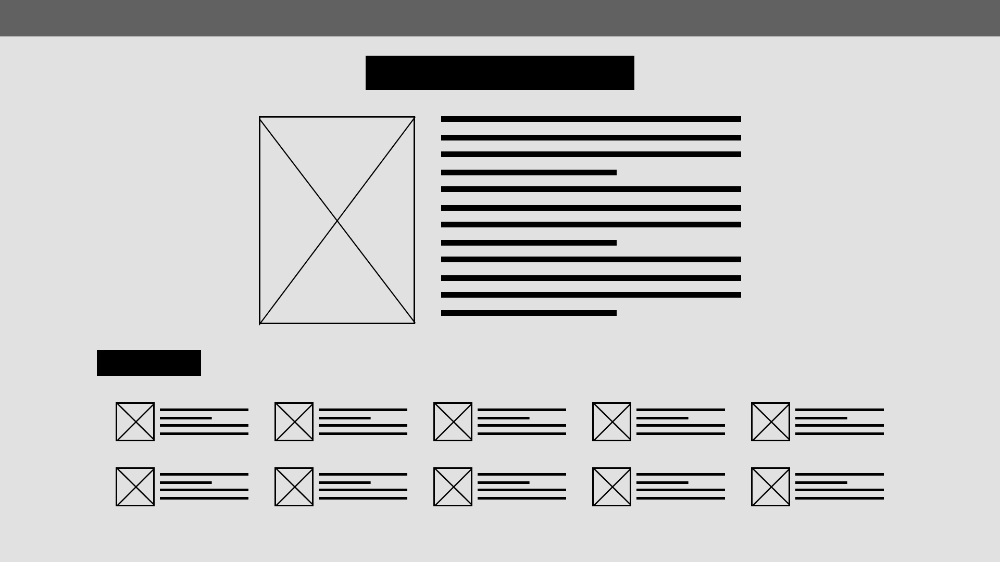
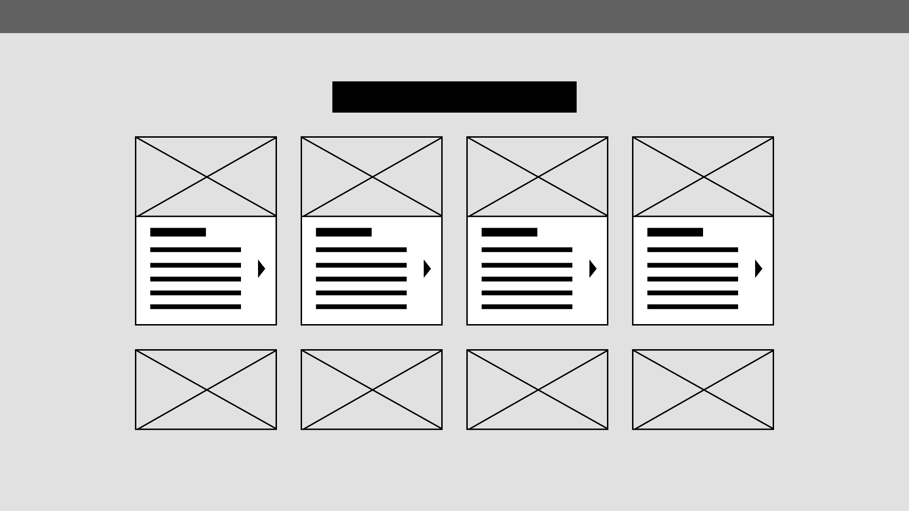
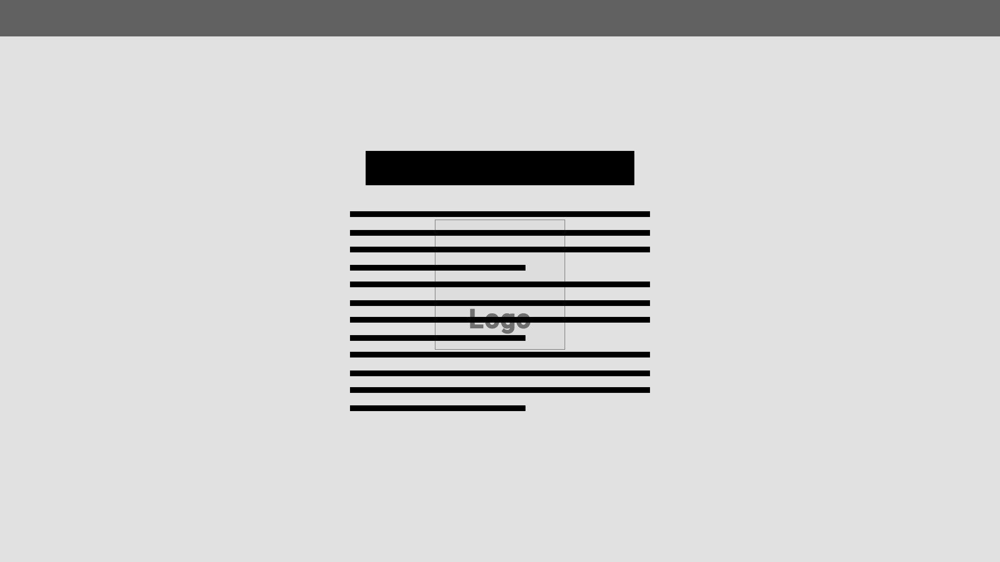
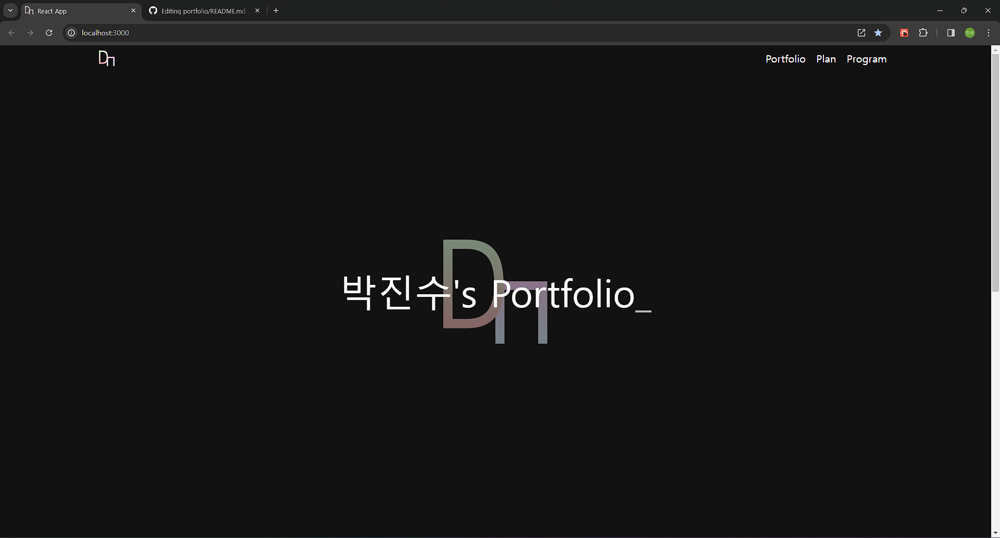
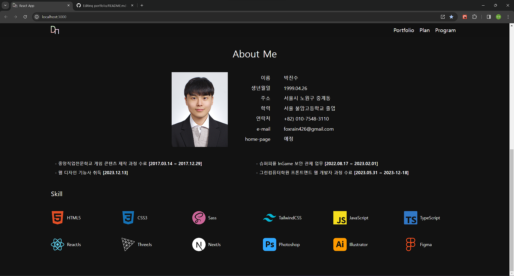
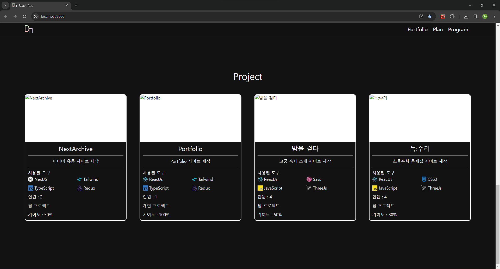

# Portfolio Project
#### Developer Tools / 개발 도구

    

    

    

    

    

#### Design Tools / 디자인 도구

    

## Development intention / 개발의도

개발자를 지망하게 되면서 <b>공부한 것</b>, <b>제작한 것</b>, <b>계획한 것들</b>, <b>가지고 있는 기술</b> 등을 소개하고 정리하는게 목적을 두었습니다.

## Plan / 계획

ReactJs의 CRA 기능을 이용하여 기본적인 작업환경을 구성 후, TypeScript와 Tailwind로 하여금 페이지를 제작할 예정입니다. NextJs를 고려하였으나 Backend와 Server에 대한 지식이 필요할 것 같아서 제외하였습니다.

## Wireframe 와이어프레임

## Version Update Log / 업데이트 기록

### 0.0.1

개발환경 구성 및 기본적인 세팅

### 0.0.2

Intro Section, About Section 제작

### 0.0.3

Project Section ProjectList Content 컴포넌트 제작

